# GreenTrace: Enterprise Afforestation Management Platform

GreenTrace is an enterprise-grade mobile application engineered to streamline large-scale afforestation initiatives, urban greening projects, and ecological monitoring. Built on the Flutter framework using Clean Architecture and the BLoC state management pattern, the platform provides real-time tracking, spatial location mapping, tree management, user role control, and data visualization tools for environmental organizations and government bodies.

The platform solves critical challenges in environmental management by replacing fragmented, paper-based tracking with a synchronized digital registry. It enables field teams and administrators to audit tree plantings, monitor survival rates across geographic zones, manage user permissions, and extract actionable reporting data through standardized API endpoints.

> **Note**: This system interacts with centralized backend microservices to ensure secure data persistence, localized offline capabilities, and role-based administrative control.

---

## Key Features

- **Authentication & Role-Based Access Control (RBAC)**: Secure user login, registration, token persistence, and access delegation distinguishing system administrators from field personnel.
- **Afforestation & Plant Lifecycle Management**: Enterprise registry for tracking individual tree species, growth status, planting dates, and biological classifications.
- **Geographic & Location Categorization**: Hierarchical location categorization system mapping trees to specific zones, land types, and coordinates.
- **Real-Time Search & Filtering Engine**: Parameterized search functionality enabling multi-attribute queries across species names, region IDs, and deployment timelines.
- **Data Export & Analytics Reporting**: Direct export functionality producing standardized reports for stakeholder auditing and ecological compliance.
- **Modular Clean Architecture**: Strict separation of concerns divided into Data, Domain, and Presentation layers, maximizing testability and code maintainability.
- **Resilient Network Layer**: Custom HTTP service layer built over Dio featuring automated header injection, token handling, timeout policies, and unified error handling.

---

## Tech Stack & Dependencies

### Core Framework & Runtime

| Technology | Version | Purpose |
|---|---|---|
| Flutter | ^3.10.4 | Cross-platform UI application framework |
| Dart | ^3.10.4 | Strongly typed client-side programming language |

### State Management & Architecture

| Package | Version | Purpose |
|---|---|---|
| flutter_bloc | ^9.1.1 | Predictable state management following the BLoC pattern |
| go_router | ^17.1.0 | Declarative routing with deep linking support |

### Networking & Storage

| Package | Version | Purpose |
|---|---|---|
| dio | ^5.9.2 | Feature-rich HTTP client for API communication |
| shared_preferences | ^2.5.5 | Local persistent storage for key-value pairs and auth tokens |

### UI Components & Utilities

| Package | Version | Purpose |
|---|---|---|
| cached_network_image | ^3.4.1 | Image caching layer with fallback handling |
| carousel_slider | ^5.1.2 | Responsive image and card carousel presentation |
| easy_localization | ^3.0.8 | Internationalization and multi-language support |
| flutter_svg | ^2.2.4 | High-performance vector graphic rendering |
| google_fonts | ^8.1.0 | Standardized typography rendering |
| shimmer | ^3.0.0 | Loading state visual indicator placeholders |

---

## User Interface Showcase

Below is a visual overview of the primary application workflows. Screenshots are grouped by operational domain and scaled for mobile interface review.

### 1. Authentication & Core Dashboards

<table>
  <tr>
    <td align="center">
      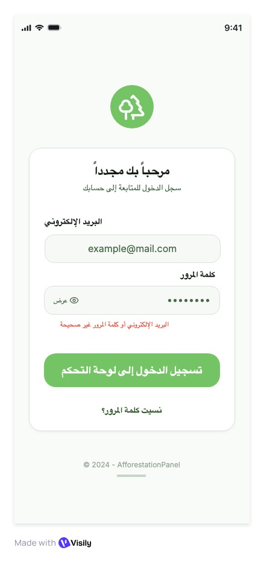<br/>
      <b>User Authentication</b>
    </td>
    <td align="center">
      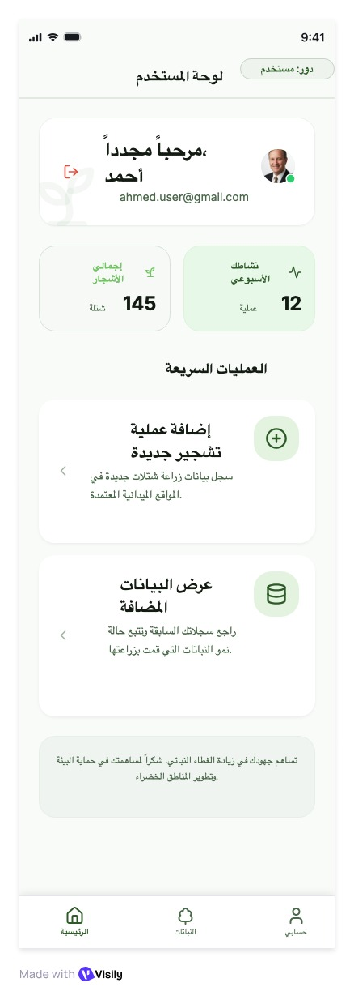<br/>
      <b>Field User Dashboard</b>
    </td>
    <td align="center">
      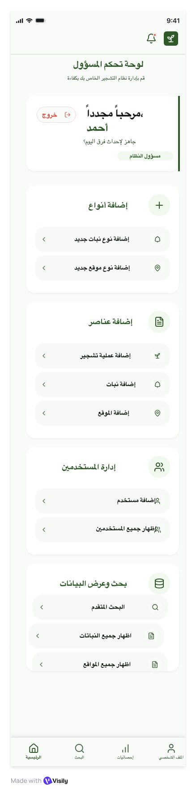<br/>
      <b>Executive Dashboard</b>
    </td>
    <td align="center">
      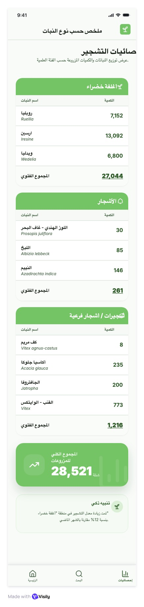<br/>
      <b>Statistical Analytics</b>
    </td>
  </tr>
</table>

### 2. Plant & Location Management

<table>
  <tr>
    <td align="center">
      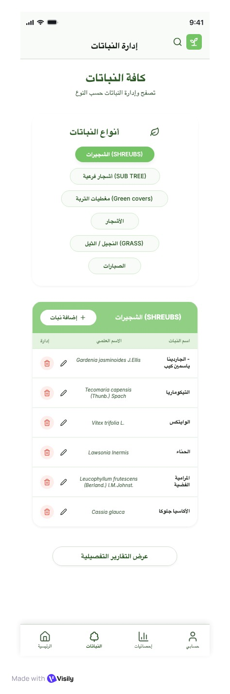<br/>
      <b>Plant Management Registry</b>
    </td>
    <td align="center">
      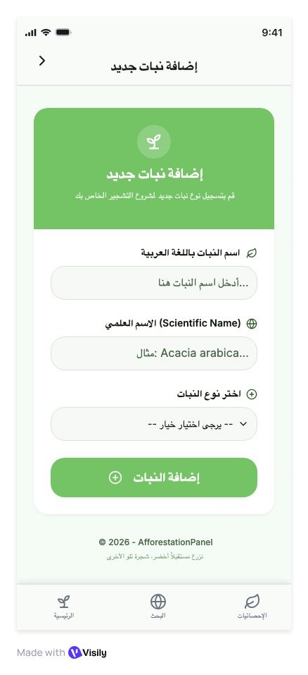<br/>
      <b>Plant Registration Form</b>
    </td>
    <td align="center">
      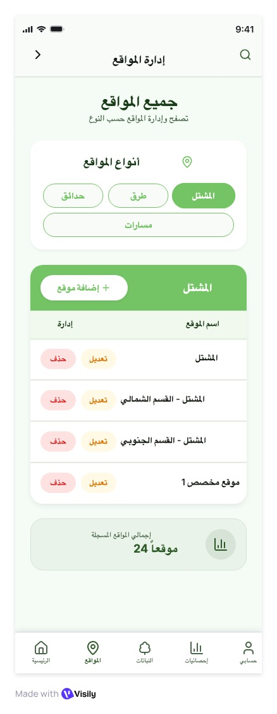<br/>
      <b>Territory Location Index</b>
    </td>
    <td align="center">
      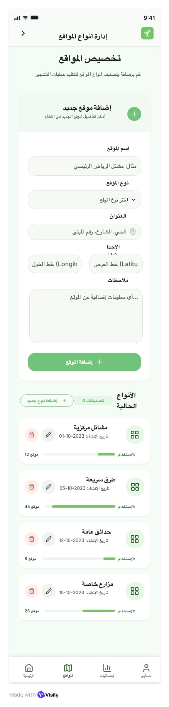<br/>
      <b>Location Registration</b>
    </td>
  </tr>
</table>

### 3. Administration, Search & Notifications

<table>
  <tr>
    <td align="center">
      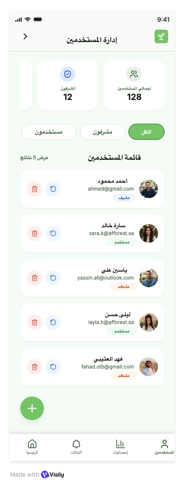<br/>
      <b>User Directory</b>
    </td>
    <td align="center">
      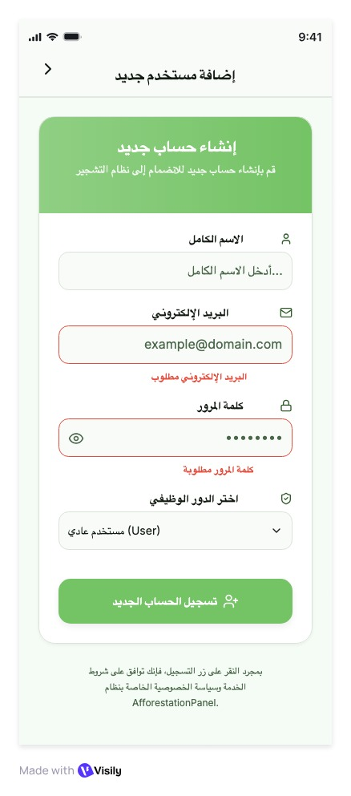<br/>
      <b>User Provisioning</b>
    </td>
    <td align="center">
      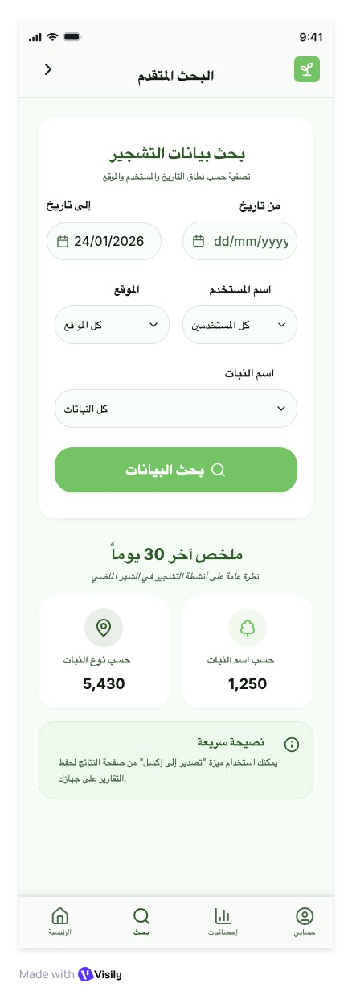<br/>
      <b>Advanced Search</b>
    </td>
    <td align="center">
      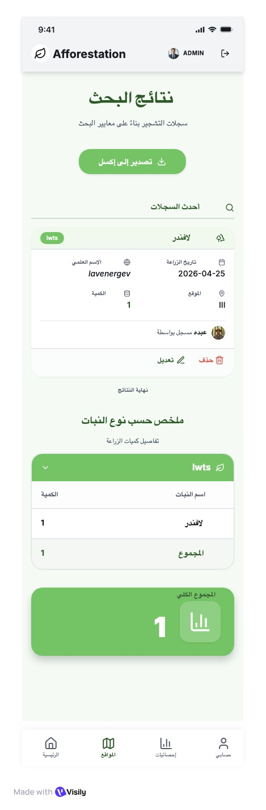<br/>
      <b>Query Results</b>
    </td>
  </tr>
</table>

---

## Project Architecture & Directory Structure

The repository follows standard Clean Architecture principles grouped by functional feature modules:

```
lib/
├── core/
│   ├── errors/             # Custom failure classes and exception handlers
│   ├── network/            # Dio HTTP client setup and base configuration
│   ├── services/
│   │   └── apis/           # API path constants and backend configurations
│   ├── theme/              # Corporate color schemes, typography, and styles
│   └── utils/              # Validators, string formatters, and helpers
├── features/
│   ├── add/                # Resource creation forms and controllers
│   ├── auth/               # Login, registration, and session logic
│   ├── dashboard/          # Metrics, executive charts, and plant lists
│   ├── location/           # Territory and location type management
│   ├── notifications/      # System alert feeds and user notifications
│   ├── search/             # Multi-criteria filter engines and queries
│   ├── splash/             # Startup initialization screens
│   └── users/              # Administrative user account management
└── main.dart               # App initialization entry point
```

---

## Prerequisites & Environment Setup

Before building the application locally, ensure your system meets the following software requirements:

- **Flutter SDK**: `3.10.4` or higher
- **Dart SDK**: `3.10.4` or higher
- **Android Studio** (for Android build target): Android SDK 33+
- **Xcode** (for iOS build target): Version 14+ (macOS required)
- **CocoaPods** (for iOS dependencies): Version 1.11+

### Environment Configuration

Create an `.env` or application configuration file in the project root if integrating localized API endpoints:

```ini
BASE_URL=https://backendtrail.runasp.net
REQUEST_TIMEOUT_MS=30000
ENABLE_LOGGING=true
```

---

## Detailed Installation & Local Development Setup Guide

Follow these sequential steps to clone, configure, and execute the application locally.

### Step 1: Clone the Repository

```bash
git clone https://github.com/your-organization/afforestation_app.git
cd afforestation_app
```

### Step 2: Install Flutter Dependencies

Fetch all external dependencies defined in `pubspec.yaml`:

```bash
flutter pub get
```

### Step 3: Run Static Analysis & Verification

Ensure code conforms to project linting rules:

```bash
flutter analyze
```

### Step 4: Launch the Application

Select an attached emulator or physical test device:

```bash
# List target devices
flutter devices

# Run application in development mode
flutter run
```

---

## API Documentation Showcase

The mobile application integrates with centralized backend REST endpoints hosted at `https://backendtrail.runasp.net`.

### 1. User Authentication

#### Login User
- **HTTP Method**: `POST`
- **Endpoint**: `/User/Login/login`
- **Headers**: `Content-Type: application/json`

**Request Body**:
```json
{
  "email": "user@organization.com",
  "password": "SecurePassword123!"
}
```

**Success Response (`200 OK`)**:
```json
{
  "statusCode": 200,
  "message": "Authentication successful",
  "data": {
    "token": "eyJhbGciOiJIUzI1NiIsInR5cCI6IkpXVCJ9...",
    "userId": "usr_948102",
    "email": "user@organization.com",
    "role": "Admin"
  }
}
```

---

### 2. Afforestation & Plant Management

#### Search Afforestation Records
- **HTTP Method**: `GET`
- **Endpoint**: `/api/afforestation/search`
- **Headers**: `Authorization: Bearer <TOKEN>`
- **Query Parameters**: `?locationId=12&treeTypeId=4&page=1`

**Success Response (`200 OK`)**:
```json
{
  "statusCode": 200,
  "data": [
    {
      "id": 101,
      "treeName": "Acacia Tortilis",
      "locationName": "North Sector Zone A",
      "quantity": 250,
      "datePlanted": "2026-03-15T00:00:00Z"
    }
  ],
  "totalRecords": 1
}
```

#### Create Afforestation Entry
- **HTTP Method**: `POST`
- **Endpoint**: `/api/afforestation`
- **Headers**: `Authorization: Bearer <TOKEN>`, `Content-Type: application/json`

**Request Body**:
```json
{
  "treeId": 4,
  "locationId": 12,
  "quantity": 150,
  "plantingDate": "2026-07-17T00:00:00Z"
}
```

**Success Response (`201 Created`)**:
```json
{
  "statusCode": 201,
  "message": "Afforestation record created successfully",
  "recordId": 102
}
```

---

### 3. Location & Territory APIs

#### Get All Locations
- **HTTP Method**: `GET`
- **Endpoint**: `/Location/GetAll`
- **Headers**: `Authorization: Bearer <TOKEN>`

**Success Response (`200 OK`)**:
```json
{
  "statusCode": 200,
  "data": [
    {
      "id": 12,
      "name": "North Sector Zone A",
      "locationTypeId": 2,
      "typeDescription": "Urban Park Zone"
    }
  ]
}
```

#### Add Location Type
- **HTTP Method**: `POST`
- **Endpoint**: `/LocationType/AddNewType`
- **Headers**: `Authorization: Bearer <TOKEN>`, `Content-Type: application/json`

**Request Body**:
```json
{
  "typeName": "Reserve Zone",
  "description": "Protected forestry reserve"
}
```

**Success Response (`200 OK`)**:
```json
{
  "statusCode": 200,
  "message": "Location type created successfully"
}
```

---

## Contribution Guidelines & Branching Strategy

To maintain high technical standards and clear release cycles, all contributors must follow the structured workflow outlined below.

### Git Flow Strategy

1. **`main`**: Production-ready release branch. Directly committing to `main` is prohibited.
2. **`develop`**: Integration branch for upcoming releases.
3. **`feature/<feature-name>`**: Branch created from `develop` for developing specific capabilities.
4. **`fix/<bug-name>`**: Branch created from `develop` for bug resolution.

### Pull Request (PR) Policy

- PRs must target `develop`.
- Every PR requires review and approval from at least one Senior Technical Lead.
- Static analysis (`flutter analyze`) must pass without errors or warnings.
- Commit messages must follow the Conventional Commits format (e.g., `feat: add tree pagination`, `fix: handle token expiration`).

---

## License

This project is licensed under the **MIT License**. For further details, see the [LICENSE](file:///Users/macbookpro/Desktop/DEPI%20Project/afforestation_app/LICENSE) file in the root repository directory.
